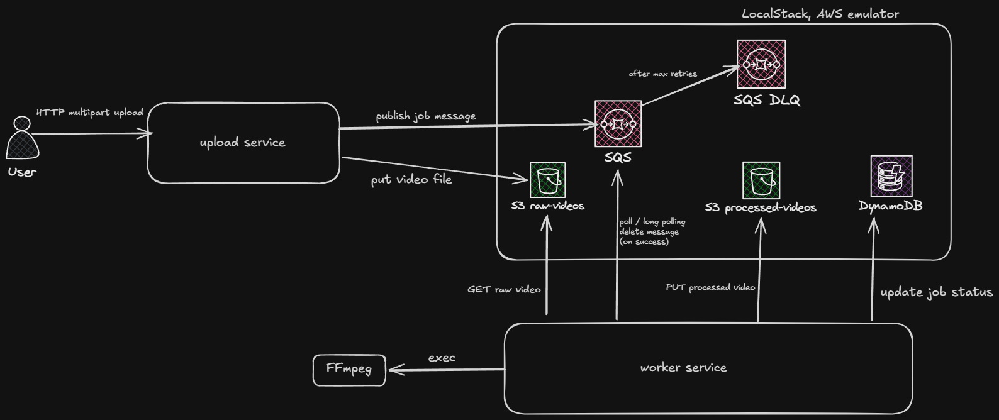

# TranscodeX

Video transcoding pipeline built to explore distributed systems primitives, queue semantics, worker lifecycle, failure isolation, and infrastructure as code.

---

## Architecture



**Flow:**
1. Client uploads video via HTTP multipart → Upload Service
2. Upload Service stores raw video in S3 and publishes a job message to SQS
3. Worker Service polls SQS, downloads the video, transcodes with FFmpeg (1080p → 720p), uploads to S3, and updates job status in DynamoDB
4. Failed jobs retry up to 3 times via SQS visibility timeout before moving to DLQ

---

## Stack

| Component | Technology |
|-----------|-----------|
| Services | Go, net/http |
| Queue | AWS SQS (LocalStack) |
| Storage | AWS S3 (LocalStack) |
| Database | AWS DynamoDB (LocalStack) |
| Transcoding | FFmpeg |
| Infrastructure | Terraform |
| Local AWS emulation | LocalStack |
| Observability | Prometheus metrics, pprof |

---

## Key Design Decisions

See [DESIGN.md](./DESIGN.md) for full trade-off analysis. Highlights:

- **At-least-once delivery** : SQS visibility timeout + idempotent job processing
- **Visibility timeout extension** : background goroutine extends timeout every 30s during active transcoding, preventing false redelivery
- **Graceful shutdown** : SIGTERM cancels active FFmpeg processes via `exec.CommandContext`, cleans up partial files, drains worker pool
- **Multipart upload** : files over 100MB use S3 multipart upload with abort-on-failure to prevent orphaned incomplete uploads
- **Worker concurrency** : configurable via `WORKER_COUNT` env var; default 2 for t2.micro-equivalent hardware

---

## Benchmark Results

### Worker Scaling : 4 concurrent jobs

| Workers | Throughput | Avg e2e | Min e2e | Max e2e |
|---------|-----------|---------|---------|---------|
| 1 | 0.97/sec | 2.70s | 1.31s | 4.12s |
| 2 | 1.14/sec | 2.73s | 1.98s | 3.52s |
| 4 | 1.44/sec | 2.75s | 2.71s | 2.78s |

4 workers provides the tightest latency distribution, all jobs processed simultaneously with no queue wait. On t2.micro with production-sized videos, `WORKER_COUNT=2` is the safe default due to FFmpeg memory usage.

### Throughput Under Load : 2 workers

| Concurrent Jobs | Throughput | Avg e2e | Max e2e |
|-----------------|-----------|---------|---------|
| 1 | 1.02/sec | 977ms | 977ms |
| 2 | 1.36/sec | 1.45s | 1.46s |
| 4 | 1.34/sec | 2.33s | 2.98s |
| 8 | 1.25/sec | 4.07s | 6.40s |

Throughput plateaus at ~1.3 jobs/sec with 2 workers which is expected backpressure behavior. Beyond 2 concurrent jobs, excess jobs queue in the worker channel and wait for a free slot.

---

## Running Locally

### Prerequisites
- Go 1.21+
- Docker Desktop
- Terraform
- FFmpeg
- AWS CLI

### Setup

**1. Start LocalStack:**
```bash
docker compose up -d
```

**2. Provision infrastructure:**
```bash
cd infra
terraform init
terraform apply -auto-approve
cd ..
```

**3. Configure environment:**
```bash
# .env is already configured for LocalStack
# verify contents:
cat .env
```

**4. Start Upload Service:**
```bash
go run ./cmd/upload
```

**5. Start Worker Service:**
```bash
go run ./cmd/worker
```

### Upload a Video
```bash
curl -X POST http://localhost:8080/upload -F "video=@your_video.mp4"
# returns: {"jobId":"...","status":"queued","createdAt":"..."}
```

### Check Job Status
```bash
curl "http://localhost:8080/jobs?id=JOB_ID"
# returns: {"jobId":"...","status":"completed","updatedAt":"..."}
```

### View Metrics
```bash
curl http://localhost:9090/metrics/json
curl http://localhost:9090/metrics          # Prometheus format
curl http://localhost:9090/debug/pprof/     # pprof
```

### Run Load Test
```bash
go run ./cmd/loadtest
```

### Teardown
```bash
docker compose down
```
LocalStack is stateless, all resources are wiped on container stop. Run `terraform apply` again on next start.

---

## Project Structure

```
transcodeX/
├── cmd/
│   ├── upload/         # Upload service entry point
│   ├── worker/         # Worker service entry point
│   └── loadtest/       # Load test tool
├── internal/
│   ├── config/         # AWS client configuration (LocalStack endpoints)
│   ├── upload/         # HTTP handler, S3 multipart upload, DynamoDB job creation
│   ├── worker/         # SQS poller, goroutine pool, processor, visibility extender
│   ├── ffmpeg/         # FFmpeg exec wrapper with context cancellation
│   └── observability/  # Prometheus metrics, pprof
├── infra/              # Terraform -> SQS, S3, DynamoDB
├── testdata/           # Test videos (not committed)
├── DESIGN.md           # Architecture decisions and trade-offs
└── docker-compose.yml  # LocalStack
```
